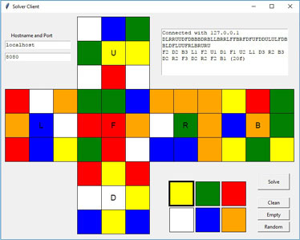

# RubiksCube-TwophaseSolver-ATM
## Overview 
This project implements the two-phase-algorithm in its fully developed form to solve Rubik's cube in Python.
But we use the **Axial Turn Metric** (ATM) here instead of the standard face turn metric. In the axial turn metric we count two
face turns which can be performed simultaneously (the faces are parallel to each other) as a single move.
Though Python is much slower than for example C++ or even Java the implementation is sufficiently fast to solve random cubes in less than 16 ATM-moves on average on slow hardware like the Raspberry Pi3 within a few seconds.

If you just want to solve Rubik's cube and play around with its patterns [Cube Explorer](http://kociemba.org/cube.htm) may be the better choice. But if you want to get a better understanding of the two-phase-algorithm details or you work on a project to build a cube solving robot which solves the cube almost optimal this this may be the right place to look.
## Usage


From a Python Console or within a Python module you can import the module solver into your code:
```python
>>> import solver as sv
```
There are several tables which must be created, but only on the first run. These need about 80 MB of disk space and it takes about 1/2 hour or even longer to create them, depending on the hardware.
But only with these computational relative expensive tables the algorithm works highly effective and usually will find near optimal solutions.

A cube is defined by its cube definition string. A solved cube has the string 'UUUUUUUUURRRRRRRRRFFFFFFFFFDDDDDDDDDLLLLLLLLLBBBBBBBBB'.   
```python
>>> cubestring = 'DUUBULDBFRBFRRULLLBRDFFFBLURDBFDFDRFRULBLUFDURRBLBDUDL'
```
See https://github.com/hkociemba/RubiksCube-TwophaseSolver/blob/master/enums.py for the exact  format.
```python
>>> sv.solve(cubestring,16,2)
```
This solves the cube described by the definition string with a desired maximum length of 16 moves and  a timeout 
of 2 seconds. If the timeout is reached, the shortest solution computed so far is returned even if it is longer than the desired maximum length.
```python
'U1D3 F2B2 U3D0 F2B0 U3D0 R0L2 F0B2 R3L2 F3B2 R3L1 U3D3 R2L1 F1B3 R3L2 F3B2 U2D0 (16a)'
```
U, R, F, D, L and B denote the Up, Right, Front, Down, Left and Back face of the cube. 1, 2, and 3 denote a 90°, 180°
and 270° clockwise rotation of the corresponding face. 0 means that the face is not turned at all.     

If you want to spend a constant of time t for each solve and just return the shortest maneuver found in this time t, do
```python
>>> sv.solve(cubestring,0,t)
```
You can test the performance of the algorithm on your machine with something similar to
```python
>>> import performance as pf
>>> pf.test(100,0.05)
```
This will for example generate 100 random cubes, solves each in 0.05 s and displays a statistics about the solving lengths.
In this example you will get an average of less than 17 moves.   

Another feature is to locally start a server which listens on a port of your choice. It accepts the cube definition string and returns the solution.
```python
>>> import server as srv
>>> srv.start(8080, 16, 2)
```
Alternatively start the server in background:
```python
>>> import start_server as ss
>>> from threading import Thread
>>> bg = Thread(target=ss.start, args=(8080, 16, 2))
>>> bg.start()
```
If you get a   

```Server socket created```  
```Server now listening...```   

message everything seems to work fine.
In this example the server listens on port 8080, the desired maximum length is 16 moves and the timeout is 2 seconds.

You can access the server - which may run also on a remote machine - by several methods.

```http://localhost:8080/DUUBULDBFRBFRRULLLBRDFFFBLURDBFDFDRFRULBLUFDURRBLBDUDL```  
 with a webbrowser if the server runs on the same machine on port 8080.  

```http://myserver.com:8081/DUUBULDBFRBFRRULLLBRDFFFBLURDBFDFDRFRULBLUFDURRBLBDUDL```  
with a webbrowser if the server runs on the remote machine myserver.com, port 8081.  

```echo DUUBULDBFRBFRRULLLBRDFFFBLURDBFDFDRFRULBLUFDURRBLBDUDL | nc localhost 8080```  
with netcat, if the server runs on the same machine on port 8080.  

You also can communicate with the server with a little GUI program which allows to enter the cube definition string interactively.
```python
>>> import client_gui
```

***


The following module is experimental. It uses the OpenCV package which eventually has to be installed with   
```$ pip install opencv-python```  
You also need the numpy package which can be installed with   
```$ pip install numpy```   

The webserver has to run and a webcam must be connected to the client.
```python
>>> import computer_vision
```

You have the possibility to enter the facelet colors with a webcam. There are several parameters which have an influence on the facelet detection quality.  If you use a Raspberry Pi with the Raspberry Pi Camera Module  and not an USB-webcam make sure you do "sudo modprobe bcm2835-v4l2" first. 

You can find some more information how to set the parameters here:
[Computer vision and Rubik's cube](http://kociemba.org/computervision.html)

***

## Performance

All computations were done on a Windows 10 machine with an
AMD Ryzen 7 3700X 3.59 GHz.   
We distinguish between computations with the standard CPython interpreter and computation with PyPy (pypy3) which
includes a Just-in-Time compiler which gives a speedup by a factor of about 10.

test(1000, 0.1) generates 1000 random cubes, the computing time for each cube is 0.1 seconds. The distribution of the
solving lengths is given.

#### Standard CPython
test(1000,0.1): {12: 0, 13: 5, 14:29, 15: 98, 16: 349, 17: 435, 18: 84, 19: 0}, average 16.43 moves  

#### PyPy (pypy3) with Just-in-Time compiler
test(1000,0.1): {12: 0, 13: 11, 14: 71, 15: 303, 16: 547, 17: 67, 18: 1, 19: 0}, average 15.59 moves  

